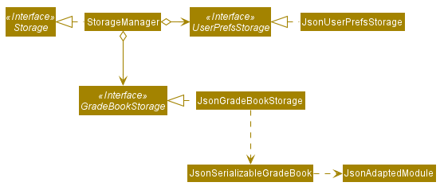
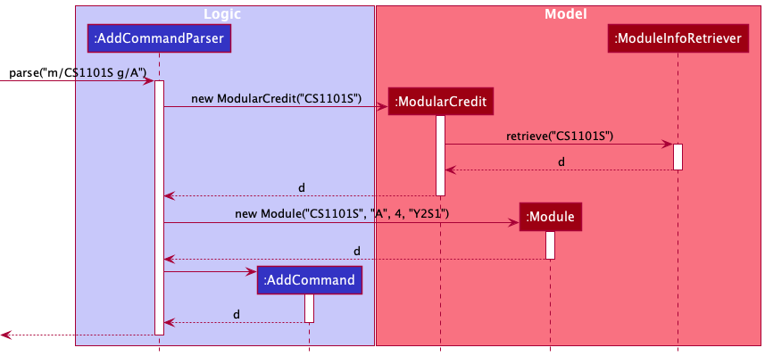
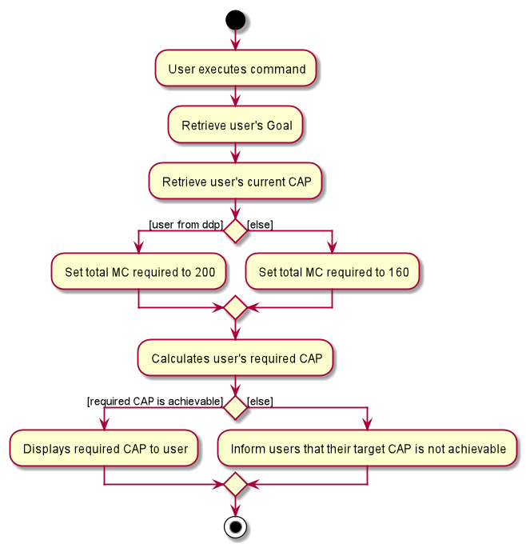

MyMods is an open source, brownfield project based on the existing [Address book Level-3](https://github.com/se-edu/addressbook-level3).
Contribute to this [project](https://github.com/AY2021S1-CS2103T-T17-1/tp)
 if you wish to help us in improving every university student's life!

### <a name="top"></a>

* **[Setting up, getting started](#Setting_up,_getting_started)**
* **[Design](#Design)**
    * [Architecture](#Architecture)
    * [UI component](#UI_component)
    * [Logic component](#Logic_component)
    * [Model  component](#Model_component)
    * [Storage component](#Storage_component)
    * [Common classes](#Common_classes)
* **[Implementation](#Implementation)**
    * [Obtaining module information automatically](#Obtaining_module_information_automatically)
    * [Recommend S/U](#Recommend_S/U)
    * [Dark/Light Mode](#Dark/Light_Mode)
    * [Start Semester](#Start_Semester)
    * [Show progress towards target CAP](#Show_progress_towards_target_CAP)
* **[Product scope](#Product_scope)**
    * [Target user profile](#Target_user_profile)
    * [User stories](#User_stories)
    * [Use cases](#Use_cases)
    * [Non-Functional Requirements](#Non-Functional_Requirements)
    * [Glossary](#Glossary)
    
--------------------------------------------------------------------------------------------------------------------

## **Setting up, getting started** <a name="Setting_up,_getting_started"></a>

Refer to the guide [_Setting up and getting started_](SettingUp.md).

--------------------------------------------------------------------------------------------------------------------

## **Design** <a name="Design"></a>

### Architecture <a name="Architecture"></a>


The ***Architecture Diagram*** given above explains the high-level design of the App. Given below is a quick overview
of each component.

**`Main`** has two classes called
[`Main`](https://github.com/AY2021S1-CS2103T-T17-1/tp/blob/master/src/main/java/seedu/address/Main.java)
and [`MainApp`](https://github.com/AY2021S1-CS2103T-T17-1/tp/blob/master/src/main/java/seedu/address/MainApp.java).
It is responsible for,
* At app launch: Initializes the components in the correct sequence, and connects them up with each other.
* At shut down: Shuts down the components and invokes cleanup methods where necessary.

[**`Commons`**](#Common_classes) represents a collection of classes used by multiple other components.

The rest of the App consists of four components.

* [**`UI`**](#UI_component): The UI of the App.
* [**`Logic`**](#Logic_component): The command executor.
* [**`Model`**](#Model_component): Holds the data of the App in memory.
* [**`Storage`**](#Storage_component): Reads data from, and writes data to, the hard disk.

Each of the four components,

* defines its *API* in an `interface` with the same name as the Component.
* exposes its functionality using a concrete `{Component Name}Manager` class
(which implements the corresponding API `interface` mentioned in the previous point.

For example, the `Logic` component (see the class diagram given below) defines its API in the `Logic.java`
interface and exposes its functionality using the `LogicManager.java` class which implements the `Logic` interface.


**How the architecture components interact with each other**

The *Sequence Diagram* below shows how the components interact with each other for the scenario where the
user issues the command `delete CS1101S`.


The sections below give more details of each component.

### UI component <a name="UI_component"></a>


**API** :
[`Ui.java`](https://github.com/AY2021S1-CS2103T-T17-1/tp/blob/master/src/main/java/seedu/address/ui/Ui.java)

The UI consists of a `MainWindow` that is made up of parts e.g.`CommandBox`, `ResultDisplay`, `PersonListPanel`,
`StatusBarFooter` etc. All these, including the `MainWindow`, inherit from the abstract `UiPart` class.

The `UI` component uses JavaFx UI framework. The layout of these UI parts are defined in matching `.fxml`
files that are in the `src/main/resources/view` folder. For example, the layout of the
[`MainWindow`](https://github.com/AY2021S1-CS2103T-T17-1/tp/blob/master/src/main/java/seedu/address/ui/MainWindow.java)
is specified in [`MainWindow.fxml`](https://github.com/AY2021S1-CS2103T-T17-1/tp/blob/master/src/main/resources/view/MainWindow.fxml)

The `UI` component,

* Executes user commands using the `Logic` component.
* Listens for changes to `Model` data so that the UI can be updated with the modified data.

### Logic component <a name="Logic_component"></a>


**API** :
[`Logic.java`](https://github.com/AY2021S1-CS2103T-T17-1/tp/blob/master/src/main/java/seedu/address/logic/Logic.java)

1. `Logic` uses the `GradeBookParser` class to parse the user command.
1. This results in a `Command` object which is executed by the `LogicManager`.
1. The command execution can affect the `Model` (e.g. adding a module).
1. The result of the command execution is encapsulated as a `CommandResult` object which is passed back to the `Ui`.
1. In addition, the `CommandResult` object can also instruct the `Ui` to perform certain actions, such as displaying help to the user.

Given below is the Sequence Diagram for interactions within the `Logic` component for the `execute("delete CS2103T")` API call.


<div markdown="span" class="alert alert-info">:information_source: **Note:** The lifeline for `DeleteCommandParser` should end at the destroy marker (X) but due to a limitation of PlantUML, the lifeline reaches the end of diagram.
</div>

### Model component <a name="Model_component"></a>


**API** : [`Model.java`](https://github.com/AY2021S1-CS2103T-T17-1/tp/blob/master/src/main/java/seedu/address/model/Model.java)

The `Model`,

* stores a `UserPref` object that represents the user’s preferences.
* stores the grade book data, semester data, and goal target data.
* exposes an unmodifiable `ObservableList<Module>` that can be 'observed' e.g. the UI can be bound to this list so that the UI automatically updates when the data in the list change.
* does not depend on any of the other three components.


### Storage component <a name="Storage_component"></a>



**API** : [`Storage.java`](https://github.com/AY2021S1-CS2103T-T17-1/tp/blob/master/src/main/java/seedu/address/storage/Storage.java)

The `Storage` component,
* can save `UserPref` objects in json format and read it back.
* can save the grade book data in json format and read it back.

### Common classes <a name="Common_classes"></a>

Classes used by multiple components are in the `seedu.address.commons` package.

<br>

[Back to top](#top)

--------------------------------------------------------------------------------------------------------------------

## **Implementation** <a name="Implementation"></a>

This section describes some noteworthy details on how certain features are implemented.

### Obtaining module information automatically: <a name="Obtaining_module_information_automatically"></a>


This feature is facilitated by ```ModuleInfoRetriever```, and is used to obtain the number of modular credits
when you are adding a module, or the “su” status of the module when you are recommending S/U options.

It implements the following operation:
```ModuleInfoRetriever#retrieve(String moduleName)``` - Returns a HashMap containing module-related information.

Given below is an example usage scenario and how obtaining module information is used and integrated into
the ```add``` command.

Step 1: The users executes ```add --mod CS1101S --grade A+```.

Step 2: Logic uses the ```AddCommandParser``` class to parse the command.
```AddCommandParser#parse(“add --mod CS1101S --grade A+”)``` is executed, which then executes
```(ModuleInfoRetriever#retrieve(“CS1101S”)``` to retrieve the number of modular credits CS1101S has.

Step 3: During the call of ```ModuleInfoRetriever#retrieve(“CS1101S”)``` , it parses the JSON file
```moduleInfo.json```, and searches the file for “moduleCode” : “CS1101S”, retrieving the following information,
returning it as a HashMap.
\
\
Title: “Programming Methodology”
\
moduleCredit: 4
\
SU: True
An exception is thrown if the module is not found.

Step 4: The new module constructor is executed with the following arguments,
```new Module(“CS1101S”, “A+”, 4, "Y2S1")```. An AddCommand object is then returned with the module,
and the new module with modular credit information is saved to storage.

#### Design Considerations:
Aspect: Whether to allow users to manually overwrite the number of modular credits attached to each module.
* Alternative 1 (current choice): Allow users the choice to manually key in how many modular credits a module has.
    * Pros:
        1. Allows users more flexibility, and enables them to dictate how many modular credits each module has.
        2. In the event that a module in our database is outdated, users are able to overwrite the outdated 
        modular credits. 
    * Cons:
        1. Users may not be fully aware of module details, and may key in incorrect modular credits.
* Alternative 2: Disallowing users to manually key in how many modular credits a module has.
    * Pros:
        1. Users will not be able to input wrong modular credits.
        2. Modules will always have accurate modular credits, given that our database is accurate.
    * Cons:
        1. In the event that our database is outdated, users have no way of overwriting the modular credits.
        This renders many functionalities of our application to be hindered, such as the calculation of CAP, 
        which requires accurate modular credits.
        
### Recommend S/U: <a name="Recommend_S/U"></a>
#### Implementation
The Recommend S/U feature works in conjunction with the goal-setting feature.
MyMods will recommend modules to S/U based on the goal that the user has set and the user’s grade. \
\
The implementation of goal-setting is first done by introducing a new model class - ```GoalTarget```.
The ```GoalTarget``` class models the 6 different levels following the Honours Classification in NUS.
For the user to set their goal, there is a ```SetCommand``` class under the logic commands.
There will be two different variants of the goal command, there is a ```SetCommandParser``` class under parser to
handle the different user’s input: ```goal set``` and ```goal list```.
The goal of the user will update a field under ```ModelManager```. \
\
User’s goal will be written to and can be read from the ```gradebook.json``` file under the attribute
“```goalTarget```” which will store a default value of ```0```. \
\
To implement the command ```RecommendSU```, a class ```RecommendSuCommand``` is introduced in logic commands.
To determine which module to recommend the user to S/U the method ```RecommendSuCommand#filterModule()``` will
retrieve the user’s goal and modules and filter using the following conditions:
1. ```RecommendSuCommand#isModSuAble(Module mod)``` -- Checks if module can be S/U by NUS based on data
file ```moduleInfo.json```.
2. ```RecommendSuCommand#isGradeBelowGoal(Module mod, GoalTarget goal)``` -- Checks if the grade of the module is
below the lower bound of the goal.
3. ```RecommendSuCommand#isGraded(Module mod)``` -- Checks if the grade of the module is valid.

The following activity diagram summarizes what happens when a user executes a new command: \


#### Design Considerations:
Aspect: How to represent the different levels of goals (Highest Distinction, Distinction, Merit, Honours, Pass, Fail)
* Alternative 1 (current choice): Labels each level with a number 1 to 6 and the user inputs the level number to
set the goal.
    * Pros:
        1. Using number to label the goals is easier for the user to type
        (eg: ```goal set 2``` instead of ```goal set distinction```)
        2. Using an integer value is more efficient for comparison as compared to a String.
    * Cons:
        1. Difficult for the user to know which level represents which goal.
* Alternative 2: User key in the full name of the goal level.
    * Pros:
        1. User knows what to key in without referring.
    * Cons:
        1. It is longer for the user to type.
* Justification of choosing Alternative 1: Having a shorter command will be easier for the user.
To solve the con of the user not sure on which level represents which goal, the command “```goal list```” is
provided.


### Dark/Light Mode: <a name="Dark/Light_Mode"></a>

#### Implementation

The dark and light mode switch is part of the UI implementation that allows the user to instantly switch between two
different styles of the application. It is facilitated by the ```MainWindow component``` in the
UI component and the ```Scene``` object from the ```Stage``` object(private property in ```MainWindow```).
**The stylesheet property in the ```Scene``` object is manipulated**. The two different stylings are supplied by
two CSS files that contain CSS styling for both dark and light mode separately.

The following method in ```MainWindow``` facilitates the switching process:
- ```MainWindow#setStyleSheet(String cssFileName)``` - sets a specific CSS file to be the current stylesheet for UI.

Flow of method:
1. “Light” is selected
2. ```MainWindow``` calls ```setStyleSheet(“Light”)```
3. ```Scene``` object is obtain from ```Stage``` object
4. An ```ObservableList<String>``` of stylesheets is obtained from ```Scene``` object
5. File path to the “Light” CSS file is added as a string that overrides the current ```ObservableList<String>```
of stylesheets

**Default theme** is Dark theme supplied by DarkTheme.css

#### User Interaction

Users have the ability to easily choose which mode under the “Theme” menu bar. Either “Dark” or “Light”.

### Start Semester: <a name="Start_Semester"></a>
Implementation

Start is a command which allows the user to start modifying the list of modules in the semester which the user
specifies by adding, editing or deleting the modules in the specified semester. The user is unable to modify the list
of modules before typing in start followed by the semester which the user wishes to edit the module list of.
A class StartCommand is added in the commands folder under logic to execute the command start.
A class SemesterManager is added in the semester folder under model to retrieve the current semester the user is in
and set the current semester to a specified semester.

### Show progress towards target CAP: <a name="Show_progress_towards_target_CAP"></a>

#### Implementation

The progress feature works in conjunction with the goal-setting feature.
The user will first need to indicate their desired CAP using the `goal` command.
\
\
Users can then use the command `progress` to calculate the required average CAP
they have to obtain in their remaining modules in order to achieve their
target CAP. The user can include the string `ddp` to indicate if they are taking
a double degree programme (e.g. `progress ddp`).
\
\
A `ProgressCommand class` is added to commands under logic to execute the required
CAP calculation. The calculation process is done as shown below:

 1. User enters their target CAP using `goal` command
 2. Info about current CAP and MCs taken are retrieved from the `ModelManager` class
 3. Total MCs required is determined by whether user is in double degree programme
 or not (e.g. user input is `progress ddp` or `just progress`)
 4. Target CAP is retrieved from the `ModelManager` class
 5. Required CAP from remaining modules is calculated.

The following activity diagram shows what happens when a user calls the `progress` command:



#### Design Considerations

Aspect: how does the user input their desired CAP.

* Alternative 1: using a prefix such as `c/` followed by their desired CAP (e.g. `progress c/ 4.32`).
    * Pros:
        1. Users can input the exact CAP number they want to achieve to get a more specific CAP requirement for their remaining modules.
    * Cons:
        1. Users have to input their desired CAP everytime they use the `progress` command.
        2. User does repeated work, since they need to set their CAP target again to use other commands like `RecommendSU`.
* Alternative 2 (current choice): using the `goal` command (e.g. `goal set 2`).
    * Pros:
        1. Length of progress command is reduced, users type lesser words.
        2. Users only need to input their target CAP once, unless they want to change it.
    * Cons:
        1. CAP target is not as flexible as it is limited to the levels of goals (Highest Distinction, Distinction, Merit, Honours, Pass, Fail).
* Justification for choosing alternative 2:
    1. Firstly, a shorter command is more convenient for the user to quickly find out the required CAP for their remaining modules.
    2. Secondly, most users do not have an extremely specific CAP target they want to achieve (e.g. 4.32) but rather one of the goal levels (e.g. Distinction), hence using the `goal` command to set their target CAP is sufficient.

<br>

[Back to top](#top)

--------------------------------------------------------------------------------------------------------------------
## **Product scope** <a name="Product_scope"></a>

### Target user profile: <a name="Target_user_profile"></a>

*   NUS students

**Value proposition**: You type, We track.

Track and view your modules and grades efficiently, anytime anywhere.


### User stories <a name="User_stories"></a>

Priorities: High (must have) - `* * *`, Medium (nice to have) - `* *`, Low (unlikely to have) - `*`


<table>
  <tr>
   <td><strong>Priority</strong>
   </td>
   <td><strong>As a …​</strong>
   </td>
   <td><strong>I want to …​</strong>
   </td>
   <td><strong>So that I can…​</strong>
   </td>
  </tr>
  <tr>
   <td><code>* * *</code>
   </td>
   <td>NUS student
   </td>
   <td>add the modules taken and grades attained
   </td>
   <td>view them anytime anywhere.
   </td>
  </tr>
  <tr>
   <td><code>* * *</code>
   </td>
   <td>NUS student
   </td>
   <td>add my modules taken to reflect my CAP, and be able to update those modules when I S/U it to reflect my updated CAP
   </td>
   <td> I can view my new CAP.
   </td>
  </tr>
  <tr>
   <td><code>* * *</code>
   </td>
   <td>NUS student
   </td>
   <td>view my current progress of my modules taken and my CAP
   </td>
   <td>have a gauge of how I am doing in school.
   </td>
  </tr>
  <tr>
   <td><code>* * *</code>
   </td>
   <td>impatient NUS student
   </td>
   <td>calculate my CAP as fast as possible without doing any calculations myself
   </td>
   <td>use the time that will be spent on doing manual calculations more productively.
   </td>
  </tr>
  <tr>
   <td><code>* *</code>
   </td>
   <td>NUS student
   </td>
   <td>delete a module taken or the grade attained in the event that I decide to drop the module
   </td>
   <td>I am able to view an updated list of the modules I am currently taking and view my CAP without the grade from the dropped module.
   </td>
  </tr>
</table>


_{More to be added}_

### Use cases <a name="Use_cases"></a>

(For all use cases below, the **System** is the `MyMods` and the **Actor** is the `user`, unless specified otherwise)

#### **Use case: Delete a module**

**MSS**


1. User requests to list modules
2. MyMods shows a list of modules he/she has taken
3. User requests to delete a specific module in the list
4. MyMods deletes the module \
Use case ends.


**Extensions**


*   2a. The list is empty. \
Use case ends.
*   3a. The given index is invalid.
    *   3a1. MyMods shows an error message.
    *   Use case resumes at step 3.

#### **Use case: Add a module**

**MSS**


1. User enters academic semester to edit
2. MyMods shows the academic semester and a list of modules he/she has taken
3. User requests to add a specific module into the list
4. MyMods adds the module \
Use case ends.


**Extensions**


*   1a. Academic semester not found \
Use case ends.
*   3a. Module moduleName already exists.
    *   3a1. MyMods shows an error message.
    *   Use case resumes at step 3.

#### **Use case: View CAP**

**MSS**


1. User requests to show CAP
2. MyMods shows CAP for the latest completed semester

**Extensions**


*   1a. No modules has been added, CAP is undefined
    *   1a1. MyMods shows an error message suggesting user to add modules \
Use case ends.

### Non-Functional Requirements <a name="Non-Functional_Requirements"></a>


1. Should work on any _mainstream OS_ as long as it has Java `11` or above installed.
2. Should be able to hold up to 1000 modules without a noticeable sluggishness in performance for typical usage.
3. A user with above average typing speed for regular English text (i.e. not code, not system admin commands) should be able to accomplish most of the tasks faster using commands than using the mouse.

_{More to be added}_


### Glossary <a name="Glossary"></a>


*   **Mainstream OS**: Windows, Linux, Unix, OS-X

<br>

[Back to top](#top)
